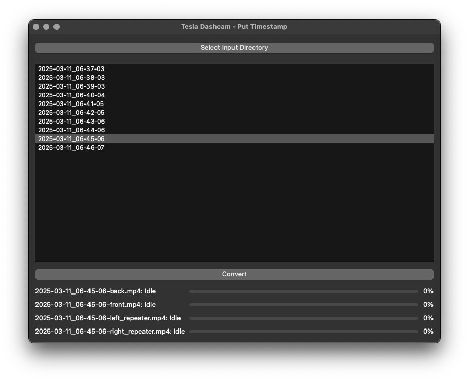
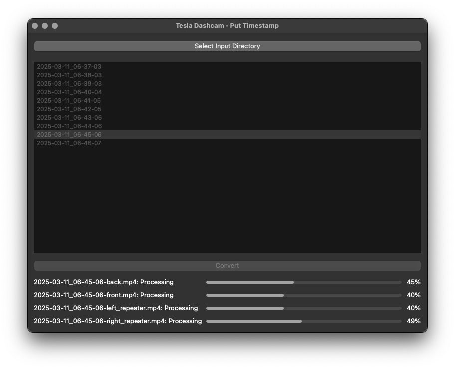

# TeslaDashcam

**Version: v0.1.0**

TeslaDashcam is a Python application designed to process Tesla dashcam video files by overlaying timestamps using FFmpeg. It provides a user-friendly GUI built with PySide6, allowing users to select input directories, view grouped video files, and convert them in parallel with real-time progress updates.

## Features

- **Directory Selection**: Select an input directory containing Tesla dashcam videos.
- **File Grouping**: Groups video files by timestamp (e.g., `yyyy-mm-dd_hh-mm-ss`), ignoring non-matching files.
- **Parallel Conversion**: Converts videos from four cameras (`back`, `front`, `left_repeater`, `right_repeater`) in parallel using `multiprocessing`.
- **Progress Monitoring**: Displays full file names, progress bars, and percentage labels for each camera.
- **Missing File Handling**: Marks non-existent files as `Missing` without updating their progress.
- **User-Friendly GUI**: Disables file selection during conversion and resets status on new selections.

## Installation

### Prerequisites

- Python 3.10 or higher
- FFmpeg installed on your system
  - macOS: `brew install ffmpeg`
  - Ubuntu: `sudo apt-get install ffmpeg`
  - Windows: Download from [FFmpeg website](https://ffmpeg.org/download.html) and add to PATH

### Python Dependencies

Install the required Python packages using pip:

```bash
pip install PySide6 ffmpeg-progress-yield
```

## Project Setup

Clone or download the repository, then navigate to the project directory:

```bash
cd TeslaDashcam
```


## Usage

1. Run the application:

```bash
python src/main.py
```

2. Run the GUI to:

- Click "Select Input Directory" to choose a directory with Tesla dashcam videos.
- Select a timestamp from the file list to view available videos.
- Click "Convert" to process the videos, with progress displayed in real-time.

3. Check the output files (yyyy-mm-dd_hh-mm-ss-camera.output.mp4) in the input directory.


## Directory Structure

```text
TeslaDashcam/
├── src/
│   ├── core/
│   │   └── video_processor.py
│   ├── main.py
│   ├── ui/
│   │   └── main_window.py
│   └── utils/
│       └── file_handler.py
└── README.md
```


## Screenshots

Below are screenshots showcasing the TeslaDashcam application in action:

- **File Selection**: Displays the list of timestamp-grouped video files available for selection in the chosen directory.
  

- **Conversion Progress**: Shows the conversion process with file names, progress bars, and percentage labels for each camera.
  


## Logging

- The application logs critical events at the INFO level (e.g., conversion completion).
- Errors and warnings (e.g., missing files, invalid timestamps) are logged for debugging.


## Notes

- Ensure FFmpeg is accessible in your system's PATH.
- Missing camera files are marked as Missing and excluded from conversion.
- Conversion uses parallel processing, which may be resource-intensive on low-core systems.
- Output files are saved in the input directory with `.output.mp4` suffix.


## License

This project is licensed under the Apache License, Version 2.0. See the `LICENSE` file for details (if included).


## Contributing

Contributions are welcome! Please submit issues or pull requests to the repository.


## Contact

For questions or support, contact the project maintainer via GitHub issues.
